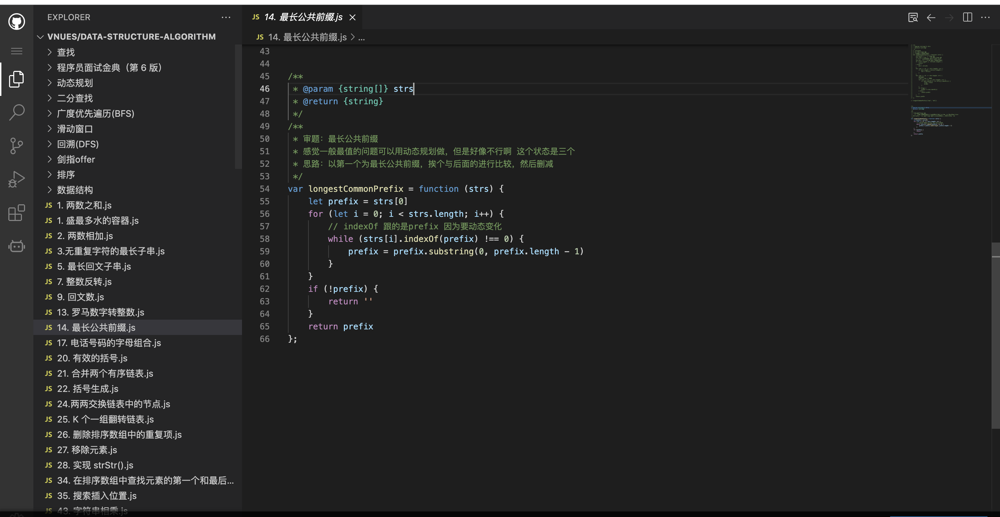

---
nav:
  title: 指南
  order: 0
toc: menu
---

## 开篇
## 为什么要学数据结构和算法

https://www.zhihu.com/question/290268306

## 面向用户

> 想入门数据结构和算法的同学，想准备跳槽的同学
## 如何学习

## 其它资料

- [图解 Java 数据结构和算法](https://zq99299.github.io/dsalg-tutorial/dsalg-java-hsp/)
- [leetcode](https://leetcode-cn.com/tag/dynamic-programming/problemset/)
- [玩转算法面试](https://coding.imooc.com/class/chapter/82.html#Anchor)